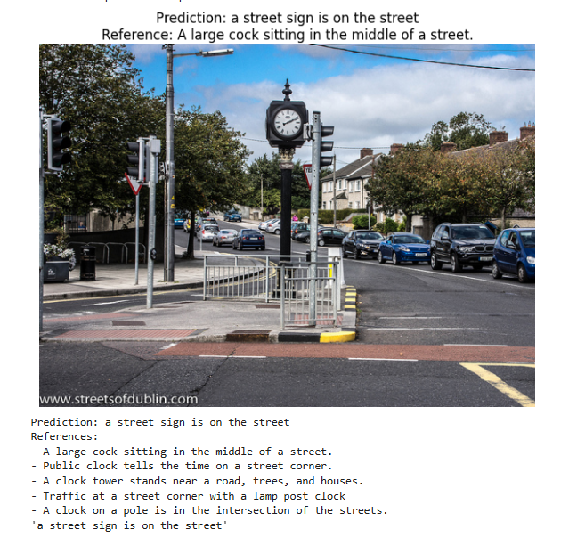

# Image Captioning Using Vision Transformers and NLP

## Project Overview

This project generates natural-language captions for images using
a pretrained Vision Transformer (ViT) encoder and a Transformer
decoder.

The model extracts visual features from an image and generates
a descriptive caption token by token.
 
## Objectives

- Extract image features using a pretrained Vision Transformer.
- Generate captions using a Transformer decoder. 
- Combine computer vision and natural language processing.
- Evaluate the generated captions against reference captions.

## Technologies Used

- Python
- PyTorch
- Torchvision
- Vision Transformer (ViT)
- Transformer Decoder
- Natural Language Processing
- Google Colab
- COCO 2017 Dataset

## Model Architecture

1. Input image
2. Image preprocessing and normalization
3. Pretrained ViT-B/16 encoder
4. Visual feature projection
5. Transformer decoder
6. Autoregressive caption generation
7. Generated image caption

## Dataset

The project uses a subset of 1,500 images from the COCO 2017
validation dataset, with their associated captions.

The dataset is divided by image ID into training, validation,
and test sets to prevent images from appearing across multiple splits.

- Training: 1,200 images
- Validation: 150 images
- Testing: 150 images

## Training

The model was trained for 7 epochs.

The best validation loss was approximately 3.8564.

The best checkpoint was selected using validation loss.

## Results

The model successfully generates captions for input images.

Quantitative caption evaluation metrics will be added after
evaluation on the test set.

### Sample Output

The following example shows a caption generated by the trained model.

## How to Run

1. Open the notebook in Google Colab.
2. Install the required dependencies.
3. Download and prepare the dataset.
4. Run the notebook cells in order.
5. Train the model or load the saved checkpoint.
6. Generate captions for images.

## Future Improvements

- Improve caption quality through further experimentation.
- Evaluate using BLEU, METEOR, and ROUGE-L.
- Compare results with alternative image-captioning architectures.
- Deploy the model as a web application.

## Author

B.Tech Computer Science and Engineering (Data Science) Student
